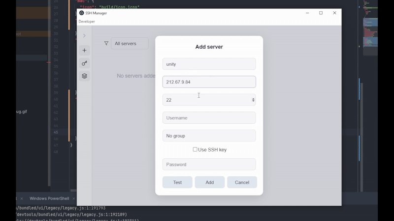

# SSH Manager

A modern desktop application for managing SSH connections with an elegant and user-friendly interface.





## Features

- **Server Management**
  - Add, edit, and delete SSH server connections
  - Group servers for better organization
  - Quick connect with a single click
  - Support for both password and SSH key authentication

- **SSH Key Management**
  - Store and manage private SSH keys
  - Easy key selection when configuring servers
  - Secure storage of sensitive data

- **Groups & Filtering**
  - Create server groups for better organization
  - Filter servers by groups
  - Quick access to frequently used connections

## Tech Stack

### Core Technologies
- **Electron** - Cross-platform desktop application framework
- **React** - UI library for building user interfaces
- **TypeScript** - Type-safe JavaScript
- **Vite** - Next generation frontend tooling

### Key Dependencies
- **electron-builder** - Application packaging and distribution
- **react-icons** - Icon components library
- **Node.js** - Runtime environment

### Development Tools
- **ESLint** - Code linting
- **Prettier** - Code formatting
- **Vitest** - Unit testing
- **Playwright** - E2E testing

## System Requirements

- Windows 7 and above (64-bit)
- macOS 10.13 and above
- Linux (Ubuntu, Debian, Fedora)

## Installation

1. Download the latest release for your operating system
2. Run the installer
3. Launch SSH Manager

## Development

```bash
# Clone the repository
git clone https://github.com/yourusername/ssh-manager.git

# Install dependencies
npm install

# Start development server
npm run dev

# Build application
npm run build
```

## Project Structure

```
├── src/                    # Source code
│   ├── components/        # React components
│   ├── utils/            # Utility functions
│   └── types/            # TypeScript type definitions
├── electron/              # Electron main process
│   ├── main/            # Main process code
│   └── preload/         # Preload scripts
└── build/                # Build assets
```

## Security
- SSH keys are handled with appropriate permissions
- No external data transmission

## Contributing

1. Fork the repository
2. Create your feature branch
3. Commit your changes
4. Push to the branch
5. Create a new Pull Request

## License

This project is licensed under the MIT License - see the [LICENSE](LICENSE) file for details.

## Acknowledgments

- Electron team for the amazing framework
- React community for components and inspiration
- All contributors who helped shape this project
